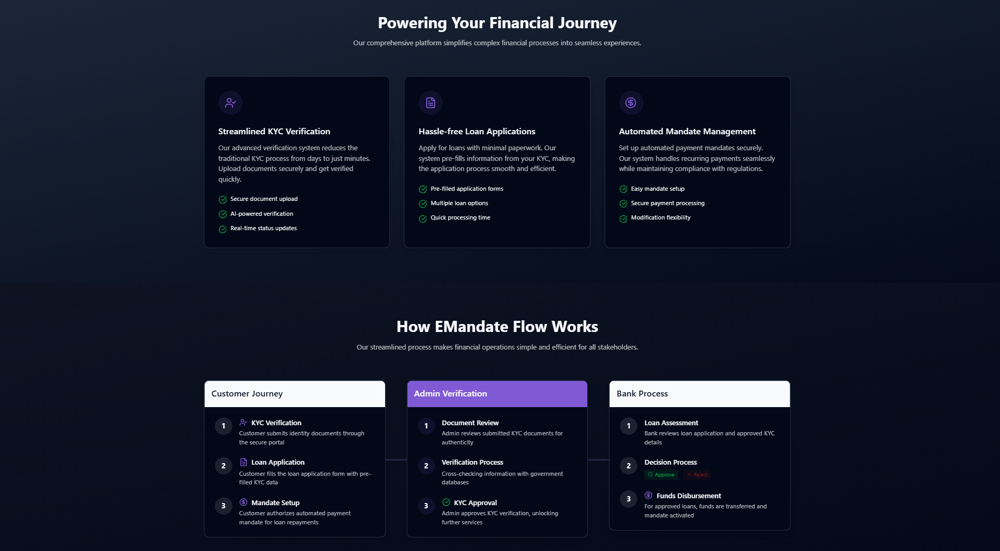
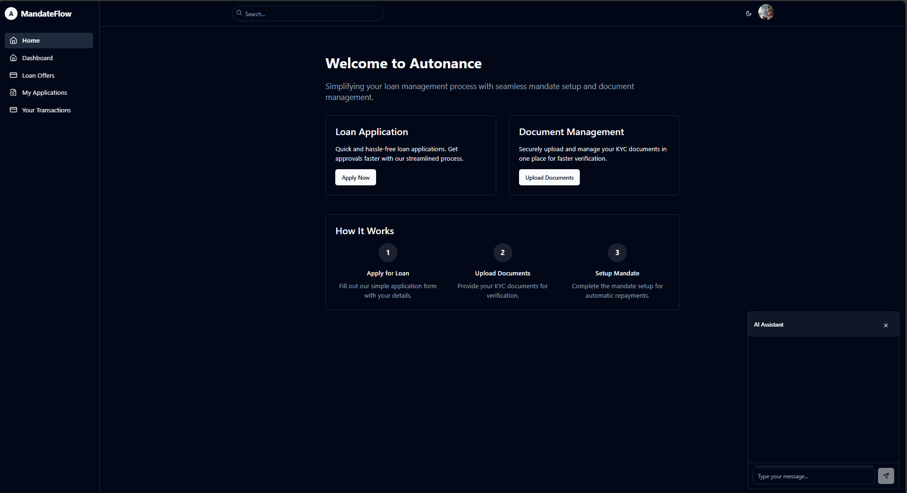
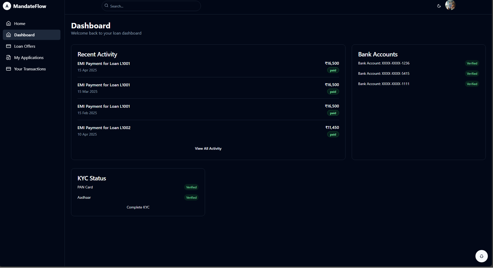
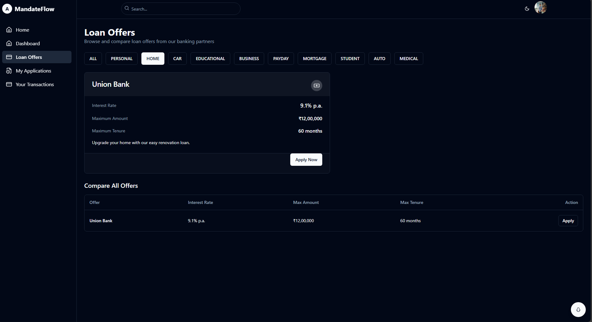
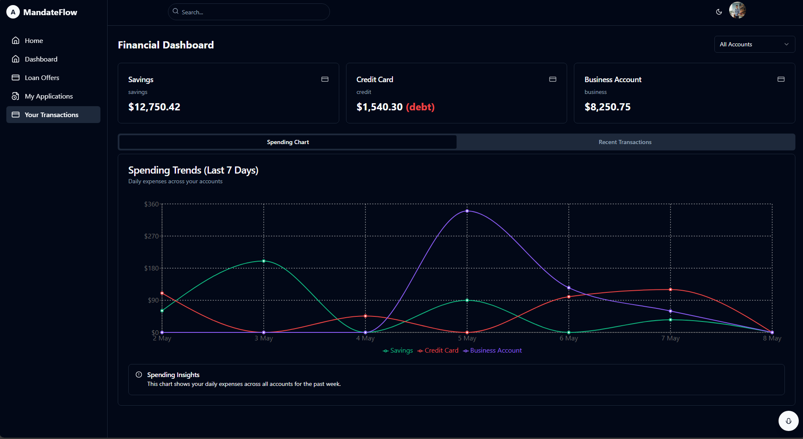

# 🚀 Autonance – Smart Loan Assistance & E-Mandate Platform (React Client - User)

Autonance is an intelligent, AI-powered platform that streamlines financial processes such as KYC verification, loan applications, and e-mandate setup. This is the **React frontend application for Customers**, offering a seamless and secure experience built with modern web technologies.

---

## 🌟 Key Features

### 🔐 Authentication
- Secure login using **Google OAuth**.

### 🛂 KYC Verification
- On first login, users are required to upload:
  - Aadhaar card image
  - PAN card image
- **OCR extraction** using **Tesseract* and **OpenCV**.
- Admins manually verify data with assistance from machine learning models.
- Verification is completed within 1–2 business days.

### 🤖 Chatbot Support
- A chatbot powered by:
  - **Mistral LLM**
  - **FAISS**
  - **Sentence Transformers**
- Guides new users through the application flow and feature usage.

### 📊 Post-KYC Functionalities
- **Transaction History**: View aggregated financial transactions.
- **Graph Analytics**: Visualize financial trends using charts.
- **Loan Application**:
  - Apply for loans from linked or unlinked banks.
  - Define custom loan purposes.

### 🧠 Loan Approval System
- Loan applications are reviewed by the selected banks.
- Evaluated using:
  - **Loan Prediction ANN model** (trained on 2005–2017 dataset)
  - User **CIBIL score**

### 🔔 Notifications
- Real-time updates via **Twilio SMS**.
- **Kafka-based event-driven architecture** ensures fast and reliable delivery.

### 🔁 E-Mandate Setup
- Post-loan approval, users must set up an e-mandate from a bank account.
- Once authorized:
  - Loan is disbursed.
  - Repayments are auto-deducted on due dates.
  - Legal action warning after multiple missed payments.

---

## 🧰 Tech Stack

| Category       | Technologies                                      |
|----------------|---------------------------------------------------|
| Frontend       | React.js, Tailwind CSS                            |
| Authentication | Google OAuth                                      |
| OCR            | Tesseract,OpenCV                                  |
| Chatbot        | Mistral LLM, FAISS, Sentence Transformers         |
| Notifications  | Twilio                                            |
|Event Driven    | Kafka                                             |

*** 

***

***

***

